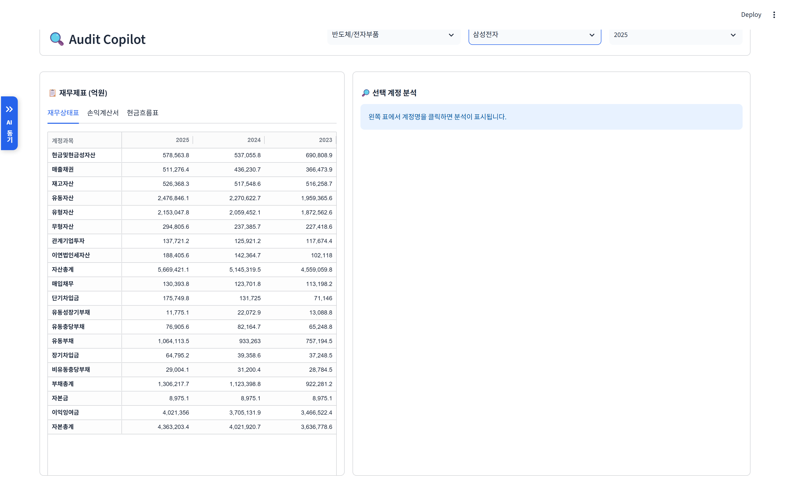
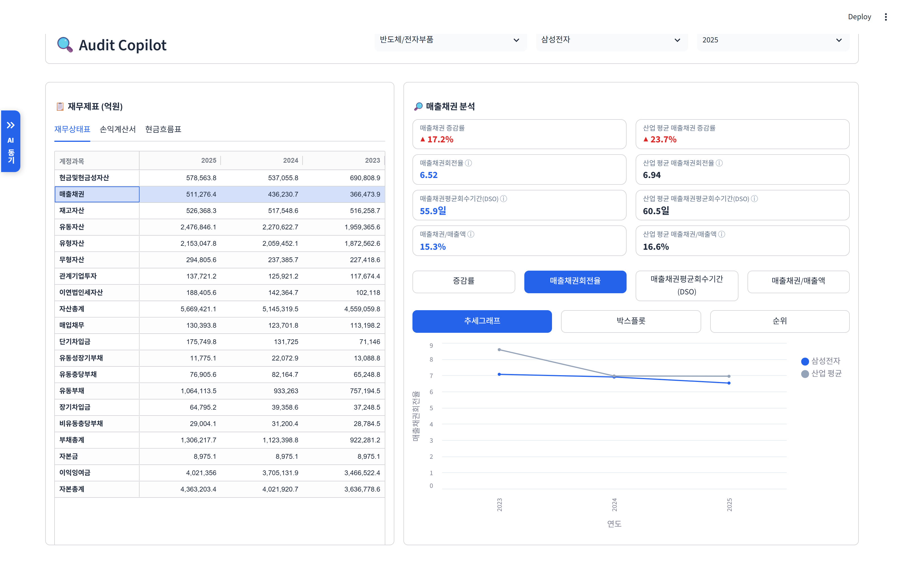
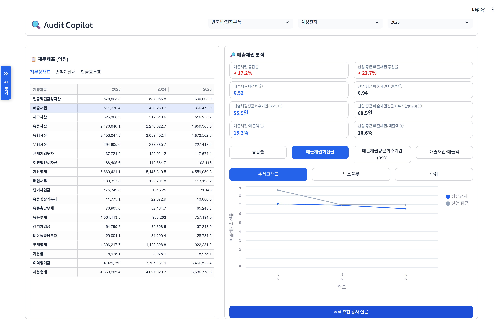
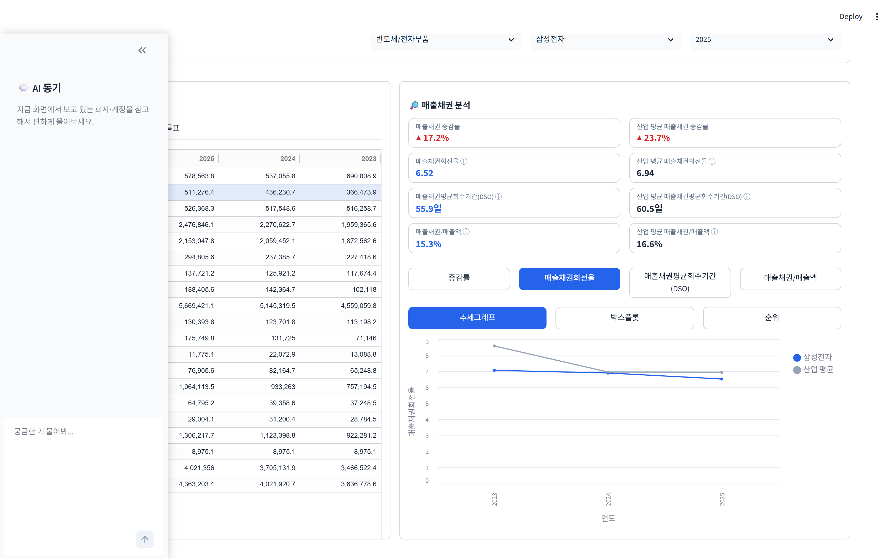

# Audit Copilot

DART 재무데이터와 감사기준서 RAG를 활용한 AI 감사 질문 추천 프로그램

🔗 **바로 실행해보기 → https://audit-copilot-jimyeongcpa.streamlit.app**

## 무슨 프로젝트인가

업종, 기업과 연도를 선택하면 재무제표를 불러오고, 계정을 클릭하면 관련 재무비율과 동종업계 비교 결과, 시각화 자료를 확인할 수 있는 감사 보조 프로그램입니다. 한 번 더 클릭하면 AI가 감사 질문 후보와 관련 감사기준서를 함께 제시합니다.

핵심은 재무제표 Raw data부터 분석 결과, AI가 제시한 근거까지 한 화면에서 확인할 수 있다는 점입니다. 이를 통해 유저는 AI의 결과가 타당한지 바로 검토할 수 있습니다. 감사 질문의 품질과 근거를 보완하기 위해 감사기준서 DB를 구축하고 RAG 방식을 적용했습니다.

AI 챗봇을 통해 자유롭게 질문할 수도 있습니다. 챗봇은 유저가 현재 보고 있는 기업과 계정, 분석 데이터를 함께 고려해 상황에 맞는 답변을 제시합니다.



## 왜 만들었는가

감사인은 정해진 시간 안에 방대한 자료를 검토하고, 발견한 이상징후를 감사 질문과 절차로 연결해야 합니다.

저는 반복적인 자료 수집과 비교는 줄이되, 최종 판단에 필요한 자료와 근거는 감사인이 직접 확인할 수 있는 도구를 만들고자 했습니다. AI가 판단을 대신하는 것이 아니라, 감사인이 중요한 판단에 집중하도록 돕는 것이 목표였습니다.

AI가 제시한 결과만 보여준다면 감사인이 그 타당성을 검토하기 어렵다고 판단했습니다. 그래서 Raw data, 재무비율, 동종업계 비교 데이터, 시각화 자료와 감사기준서 근거를 한 화면에서 함께 확인하도록 설계했습니다. 또한 적은 수의 클릭만으로 필요한 정보에 접근할 수 있도록 화면 구성과 사용 편의성도 중요하게 고려했습니다.



계정을 클릭하면 AI가 관련 감사 질문 후보와 근거가 된 감사기준서 원문을 함께 제시합니다.



현재 보고 있는 기업·계정·분석 데이터를 반영해 답하는 AI 챗봇도 있습니다.



## 만들면서 어려웠던 점

**기업마다 재무데이터의 형태가 달랐습니다.** 계정명과 XBRL 태그, 공시 방식이 기업마다 달라 하나의 기준으로 처리하기 어려웠습니다. 이를 일률적으로 합산하기보다, 데이터의 공시 형태와 한계를 알리고 필요한 경우 유저가 분석에 사용할 값을 직접 선택하도록 했습니다.

**어떤 분석이 실제로 필요한지 판단하기 어려웠습니다.** 감사 실무 경험이 없어 어떤 기능이 유저에게 실제로 도움이 될지 판단하기 어려웠고, 회전율과 회수기간 등 일반적으로 활용되는 지표부터 우선 적용했습니다.

**AI 질문의 근거가 부족했습니다.** 초기에는 AI가 감사기준서가 아닌 일반적인 정보를 바탕으로 질문을 생성했습니다. 이를 보완하기 위해 감사기준서를 DB화하고 RAG를 적용했습니다. 관련 기준서 내용을 먼저 검색한 뒤 감사 질문을 생성하고, 근거 원문도 함께 제시하도록 구성했습니다.

## 배운 점과 앞으로

이번 프로젝트를 통해 데이터와 AI를 실무에 활용하려면 기획과 도메인 지식이 무엇보다 중요하다는 점을 배웠습니다. 먼저 어떤 문제를 해결하고 어떤 정보를 보여줄지 정해야 하며, 어떤 데이터를 사용하고 결과를 어떻게 해석할지는 감사인의 도메인 지식 없이는 결정하기 어렵기 때문입니다.

현재 형태 그대로는 실무에서 바로 활용하기 어려울 수 있습니다. 다만 계정을 클릭하면 분석 결과가 나타나고 AI가 이를 바탕으로 판단에 필요한 검토사항과 근거를 한 화면에 제시하는 흐름은, 구체적인 실무 문제가 주어진다면 그에 맞게 다듬어 실제 업무에 도움이 되는 도구로 발전시킬 수 있다고 봅니다.

## 기술 스택

Streamlit · OpenDART API · Google Gemini (RAG) · pandas

## 실행 방법

```bash
pip install -r requirements.txt
# .streamlit/secrets.toml 에 OPENDART_API_KEY, GEMINI_API_KEY 설정
streamlit run app.py
```
